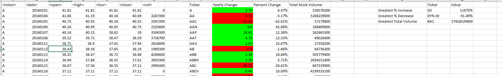

# VBA: Wall Street

## Overview
Use VBA to analyze and visualize real stock market data for three consecutive years (2014 - 2016).

* Create a script that will loop through all the stocks for one year and output the following information.

  * The ticker symbol.

  * Yearly change from opening price at the beginning of a given year to the closing price at the end of that year.

  * The percent change from opening price at the beginning of a given year to the closing price at the end of that year.

  * The total stock volume of the stock.

Run code to returning the stock with the "Greatest % increase", "Greatest % decrease" and "Greatest total volume".

## 2014 Stock Market Analysis:

## 2015 Stock Market Analysis:

## 2016 Stock Market Analysis:

